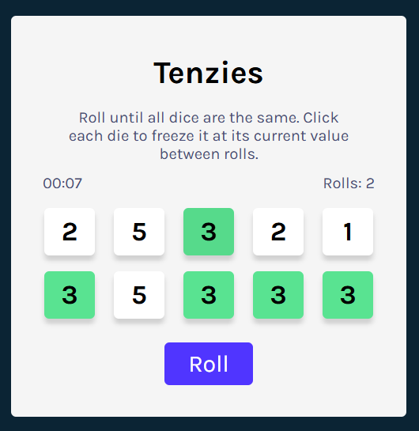

# Tenzies

A simple and fun dice game built with React. The goal is to roll until all ten dice are the same. Click a die to freeze it at its current value between rolls.

[**View Live Demo**](https://maelkmark.github.io/learning-react/tenzies/)

## About The Project

I made this game following the [React course](https://scrimba.com/learn-react-c0e]) on [Scrimba](https://scrimba.com/home). I remade it from scratch to make sure I understand everything. I also added some bonus features: a timer and a roll counter. I hope you'll like it!

You can compare my solution with the [final result in the course](https://scrimba.com/learn-react-c0e/~04ao).

## See Also

You can find my other React projects in my [learning-react](https://github.com/MaelkMark/learning-react/tree/main) repo.

## Screenshot

